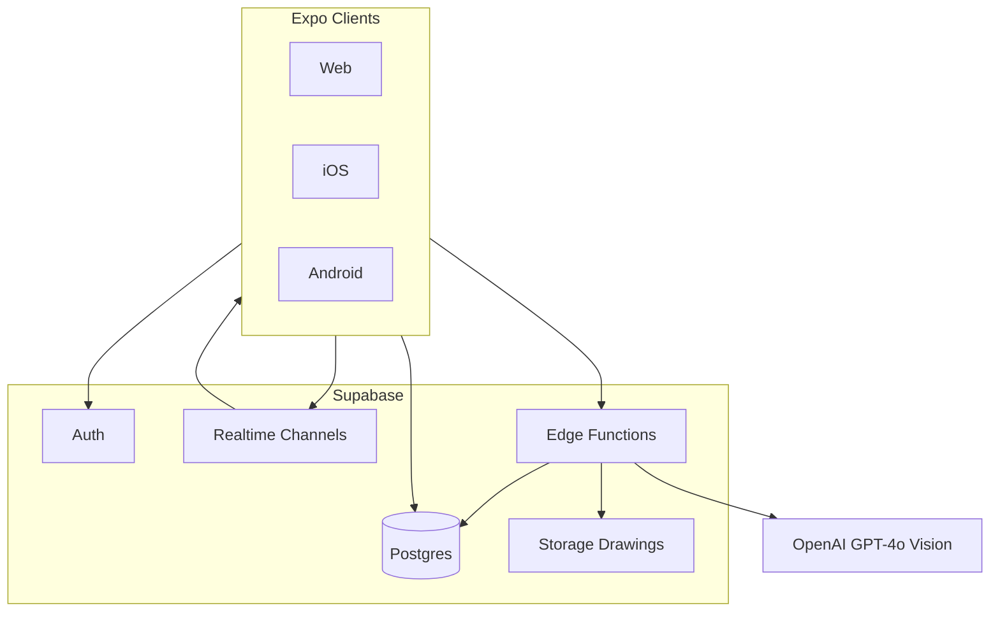
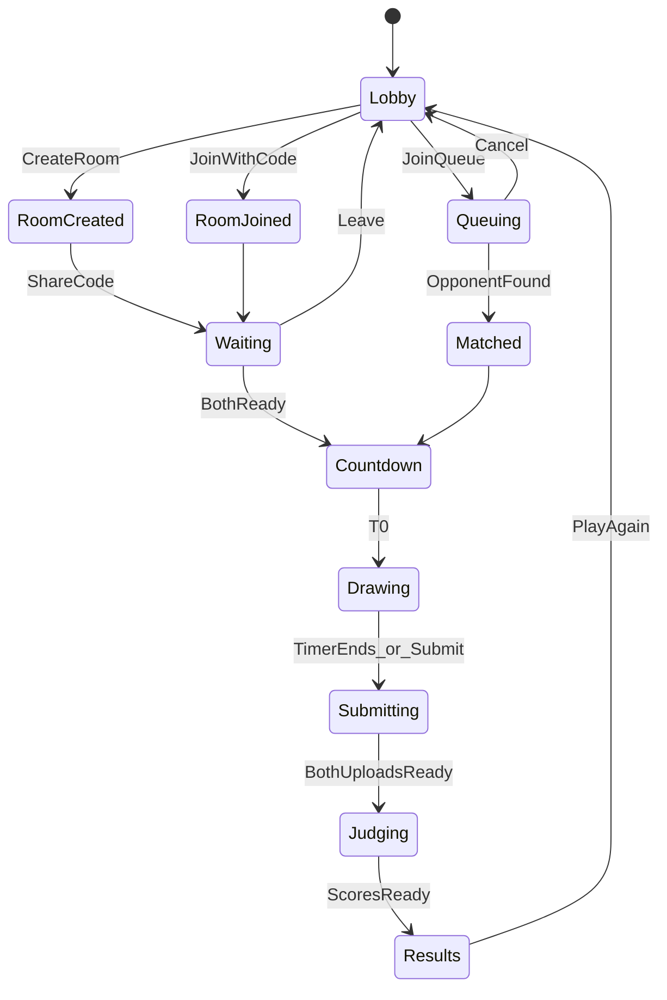
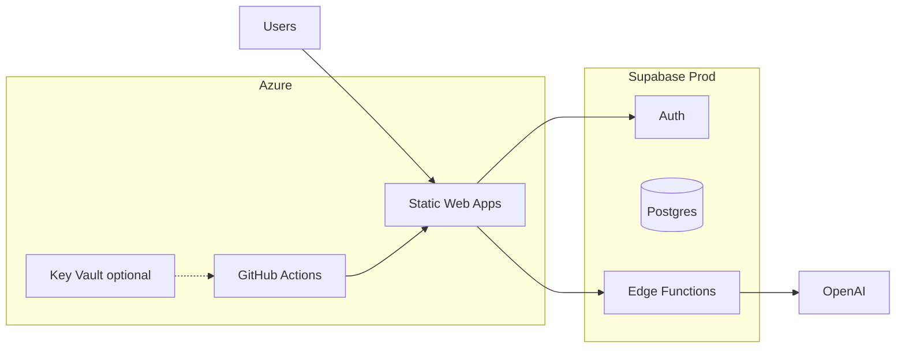

# Drawing-Battle: Comprehensive Product & Technical Plan

**Version:** 0.1 draft — still needs team agreement before approval.

## Product summary

Drawing-Battle is a real-time 1v1 game: two players get the same prompt, sketch for 60 seconds (pen + eraser), and an AI Vision model scores both drawings against the prompt and declares a winner. Built as an internal training ground for AI integrations and realtime sync, and as a quick competitive loop for casual players.

**Success metrics (from README):**
- 100 head-to-head matches without server desync in internal beta
- AI scoring latency under 3 seconds per match

---

## Locked decisions

| Area | Choice |
|------|--------|
| Client | Expo (React Native) — one codebase for iOS, Android, and web |
| Backend | Supabase (Auth, Postgres, Realtime, Storage, Edge Functions) |
| Matchmaking | Public random queue **and** private room codes |
| Accounts | Guest play + optional signup to persist win/loss |
| AI Vision | OpenAI GPT-4o (vision), behind a provider interface for easy swap |
| Hosting | Azure (production target for the web app and supporting infra) |
| Release bar | Production-ready for internal/public beta — not a prototype-only scaffold |

**Why these defaults:** Expo matches “modern web and mobile” with one UI. Supabase covers auth, DB, and realtime without a custom socket server while still teaching Postgres and event-driven sync. OpenAI vision is well-documented for doodle-vs-prompt scoring; a thin adapter keeps Gemini/Claude as drop-in replacements. Azure is the production host so the team practices cloud deployment, secrets, and environments alongside the game stack.

---

## Out of scope (v1)

- Elo / ranked ladders
- Monetization, ads, IAP
- Friends lists, chat, custom avatars
- Advanced drawing tools (colors, layers, brushes beyond pen/eraser)

---

## High-level architecture



**Responsibilities:**
- **Expo app:** lobby, matchmaking UI, canvas, timer, results, profile
- **Supabase Auth:** anonymous guests + optional email/OAuth upgrade
- **Postgres:** users, matches, drawings metadata, win/loss
- **Realtime:** match room state, countdown sync, opponent presence, phase transitions
- **Storage:** final canvas PNGs (or strokes) for judging and history
- **Edge Functions:** secure AI calls (API key never on client), scoring, match settlement

---

## Core game loop



**Phases (server-authoritative via match row + Realtime):**
1. **Lobby** — play as guest or signed-in; queue or create/join room
2. **Matched / Waiting** — both players linked to a `matches` row; prompt assigned once both present
3. **Countdown** — short synced countdown (e.g. 3s) so timers align
4. **Drawing** — 60s shared deadline (`drawing_ends_at` timestamp); pen + eraser only
5. **Submitting** — upload canvas image; wait for opponent (timeout → forfeit / incomplete)
6. **Judging** — Edge Function calls OpenAI; writes scores + winner
7. **Results** — show both drawings, scores, winner; update W/L if profile linked

---

## Data model (Postgres)

Core tables (simplified):

- **`profiles`** — `id` (auth.uid), `display_name`, `is_guest`, `wins`, `losses`, `created_at`
- **`matchmaking_queue`** — `user_id`, `joined_at` (or use Realtime presence + Edge Function matcher)
- **`rooms`** — `id`, `code` (6-char), `host_id`, `status`, `created_at`
- **`matches`** — `id`, `room_id` nullable, `player_a`, `player_b`, `prompt`, `status`, `drawing_ends_at`, `winner_id`, `created_at`
- **`match_submissions`** — `match_id`, `user_id`, `storage_path`, `score` nullable, `submitted_at`
- **`prompts`** — curated list of short drawables (`text`, `difficulty` optional)

**Realtime strategy:** subscribe to `matches` row + a match-scoped channel for presence. Clients derive UI from `status` and timestamps — not from local clocks alone — to hit the “no desync” metric.

**RLS:** players can read their own profile and matches they’re in; only Edge Functions (service role) write scores/winners and call OpenAI.

---

## Matchmaking

**Public queue:**
- Player joins queue → Edge Function or DB trigger pairs two oldest waiters → create `matches` → notify via Realtime → both navigate to match

**Private rooms:**
- Host creates room → gets short code → guest joins with code → when 2 players, create `matches` with shared prompt

**Guards:** one active match/queue entry per user; stale queue/room cleanup (TTL); reconnect rejoins existing match by `user_id`.

---

## Drawing canvas (mobile-friendly)

- Cross-platform canvas (e.g. `react-native-skia` or SVG path canvas with web fallback)
- Tools: **pen** and **eraser** only (MVP)
- Local stroke buffer; on timer end / submit → rasterize to PNG → upload to Storage
- Do **not** stream every stroke to the opponent in v1 (reduces desync surface); only final images + phase sync matter for judging
- Optional later: spectator stroke sync; not required for MVP metrics

**Timer sync:** server stores `drawing_ends_at`; clients show `max(0, ends_at - now)` with NTP-ish correction via server time on subscribe. Late submit after grace window = invalid/forfeit.

---

## AI judging

**Provider:** OpenAI GPT-4o vision via Edge Function.

**Flow:**
1. Both submissions present (or timeout policy applied)
2. Edge Function loads both images + prompt
3. Structured prompt asks for per-drawing scores (0–100) and brief rationale for similarity to the prompt
4. Persist scores; set `winner_id` (tie = null or explicit draw status)
5. Latency budget: target **< 3s** — parallel image fetch, small images (e.g. max dimension 512–768px), single API call with both images if supported

**Abstraction:** `VisionJudge` interface (`score(prompt, imageA, imageB) → { scoreA, scoreB, winner }`) with OpenAI implementation; Gemini/Claude adapters can be added without changing match flow.

**Risk (README assumption):** doodle accuracy may be noisy — mitigate with clear prompts, score rubrics (“recognize subject, not artistic quality”), and curated easy prompts for beta.

---

## Auth & profiles

- **Guest:** Supabase anonymous sign-in → auto `profiles` row (`is_guest = true`), ephemeral display name
- **Optional upgrade:** email magic link or OAuth → same `profiles.id` linked; wins/losses retained
- Profile screen: display name, W/L, recent matches (simple list)
- No friends/social in v1

---

## App structure (Expo)

Monorepo-style single Expo app (or Expo + thin shared package if needed):

```
/app                  # Expo Router screens
  /(auth)/            # optional sign-in / upgrade
  /(main)/lobby
  /(main)/queue
  /(main)/room
  /(main)/match       # canvas + timer
  /(main)/results
  /(main)/profile
/src
  /features           # match, canvas, auth, profile
  /lib/supabase.ts
  /lib/vision/        # types only on client; calls Edge
supabase/
  migrations/
  functions/          # matchmake, judge-match, settle
```

**UI direction:** fast game feel — strong brand “Drawing-Battle”, one CTA in lobby (Play / Create room / Join), minimal chrome during drawing. Follow existing brand rules when designing screens (no purple-default AI look; expressive type; atmospheric background).

---

## Hosting & environments (Azure)

**Target:** production-ready deployment on **Azure**, with clear separation of **dev** and **prod**.

| Concern | Approach |
|---------|----------|
| Web client | Build Expo web export; host as static assets on **Azure Static Web Apps** (or App Service if SSR/proxy needs arise) |
| Custom domain / HTTPS | Azure-managed TLS; prod custom domain when available |
| Mobile binaries | **EAS Build** for iOS/Android store or internal distribution; app points at prod Supabase + Azure-fronted config |
| Backend data/realtime | **Supabase** projects: separate **dev** and **prod** (Auth, Postgres, Realtime, Storage, Edge Functions) |
| Secrets | `OPENAI_API_KEY` and service keys only in Supabase Edge secrets / Azure Key Vault / SWA app settings — never in client bundles |
| Config | `EXPO_PUBLIC_*` for public Supabase URL/anon key per environment; no private keys in the app |
| CI/CD | GitHub Actions → lint/typecheck → build web → deploy to Azure (dev on main/PR preview if enabled; prod on release/tag or protected branch) |
| Observability | Client error reporting + Azure/SWA diagnostics; match phase and AI latency metrics for success criteria |
| CORS / API | Edge Functions and Storage configured for prod web origin(s) only |



**Environments:**
- **Local** — Expo + Supabase local or shared dev project
- **Dev (Azure)** — continuous deploy for QA; non-prod OpenAI key / spend caps
- **Prod (Azure)** — protected deploy path, prod Supabase, monitored AI latency and desync metrics

---

## Production-ready bar (v1)

“Production-ready” for Drawing-Battle means a shippable beta, not an unfinished prototype:

- **Reliable game loop** — server-authoritative match phases; reconnect resumes the correct match; no stuck lobby/queue under normal failure
- **Security** — RLS on all player-facing tables; AI and settlement only via Edge Functions (service role); secrets out of the client; basic rate limits on queue/room create
- **Ops** — automated Azure deploy; env-specific config; health of deploy pipeline documented in README
- **Quality** — TypeScript throughout; lint in CI; smoke path for lobby → room/queue → match shell on web
- **Performance** — AI judging path designed for **under 3 seconds**; canvas usable on mid-tier mobile and desktop web
- **Observability** — log/measure match completion and scoring latency against README success metrics
- **Docs** — setup (Supabase, Azure, env vars), run locally, deploy to Azure

Store listing polish and full SLA multi-region HA are **out of scope** for v1; Azure + prod Supabase + the checklist above are in scope.

---

## Implementation phases (for when you approve building code — not now)

1. **Foundation** — Expo app scaffold, Supabase project, auth (anon + upgrade), profiles schema + RLS
2. **Lobby & rooms** — create/join room codes, presence, match creation + prompt assignment
3. **Queue** — matchmaking pairing + Realtime handoff into same match flow
4. **Canvas & timer** — pen/eraser, 60s server deadline, upload submissions
5. **Judging** — Edge Function + OpenAI adapter, results screen, W/L updates
6. **Hardening** — reconnect, timeouts, stale cleanup, latency/desync instrumentation against success metrics
7. **Azure & production** — env config, GitHub Actions → Azure Static Web Apps, secrets, prod Supabase, deploy docs
8. **Polish** — web responsive canvas, onboarding copy, prompt pack, internal beta on Azure prod

---

## Risks & mitigations

| Risk | Mitigation |
|------|------------|
| AI poor at judging scribbles | Rubric + easy prompt set; A/B provider via adapter |
| Mobile network desync | Server timestamps + match status machine; reconnect by match id |
| Queue starvation | Short TTL + “play with friend” rooms as primary path for demos |
| Canvas perf on web vs native | Prefer Skia/shared path model; test early on both |
| Guest abuse / spam matches | Rate limits on queue/room create; anon session caps |
| Azure/Supabase env drift | Separate dev/prod projects; checked-in infra docs; CI deploy only from main/release |
| Secret leakage in Expo web | Public env vars only for anon keys; OpenAI solely on Edge Functions |

---

## Deliverable for this planning step

This document is the approved product and technical plan at the repo root (including Azure hosting and a production-ready bar). **No application code, scaffolding, or dependencies** until implementation is separately requested.
